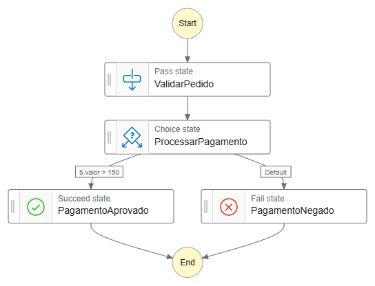
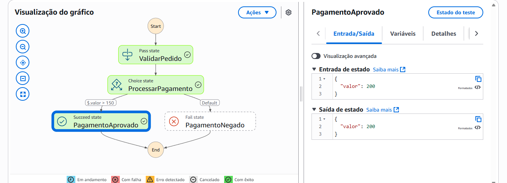
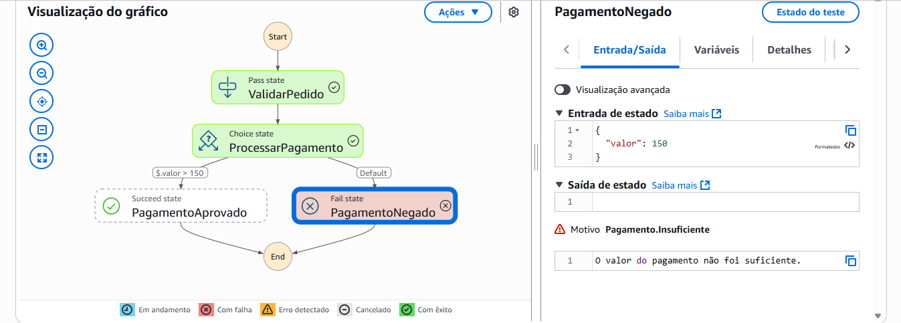

# AWS Step Functions Lab

## 1. Sobre o Desafio
Este repositório documenta minha prática com **AWS Step Functions**, consolidando conceitos aprendidos nas aulas da DIO. Objetivo foi criar workflows automatizados e entender a lógica de escolha de estados, usando Pass, Choice, Succed e Fail.

## 2. Objetivos de Aprendizagem
- Aplicar conceitos de AWS Step Functions em um ambiente prático.
- Documentar processos técnicos de forma clara e organizada.
- Usar Github como ferramenta de compartilhamento de documetação.

## 3. Descrição do Projeto
O projeto consiste em uma **State Machine** que simula a validação de pedidos e processamento de pagamento:
- **ValidarPedido:** Estado do tipo Pass para validar o pedidio.
-  **ProcessarPagamento:** Estado do tipo Choice para decidir aprovação com base no valor.
-  **PagamentoAprovado:** Estado do tipo Succed.
-  **PagamentoNegado:** Estado do tipo Fail quando o pagamento não atende ao critério.

## 4. Fluxo da State Machine
- **Critério de aprovação:** valor do pagamento > 150
-  **Critério de negação:** valor <= 150
-  Segue as imagens do projeto AWS:

  
## 5. Arquivos inclusos
- `step-functions.json`: JSON da State Machine utilizada
- `/imagens`:prints de execução ou diagramas do workflow (opcional).

## 6. Aprendizados e Insights
Durante o laboratório, aprendi que:
- O **Choice State** só funciona se o path de input existir no estado.
- O `Pass State` pode ser usado para injetar valores fixos ou encaminhar input.
- O `ResultPath` é essencial para controlar como o output do Pass se integra ao input do próximo estado.
- Testar diferentes inputs ajuda a entender a lógica de aprovação e falha.